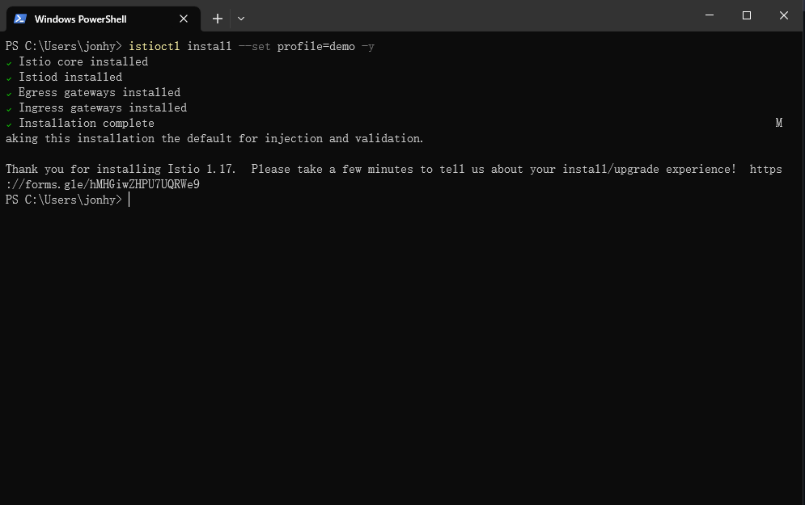
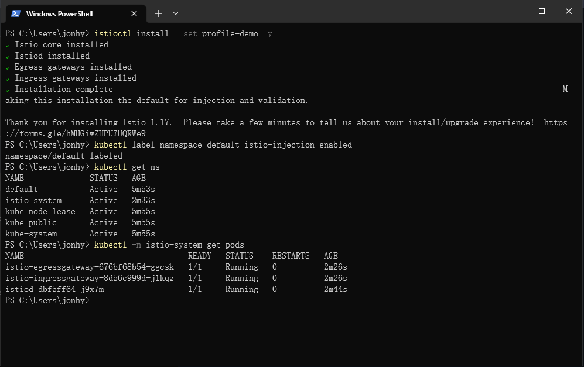
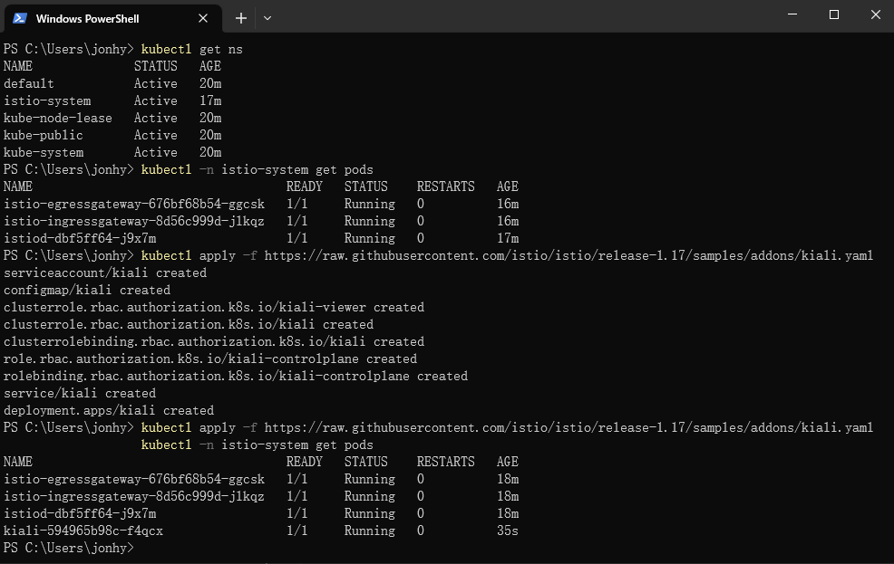
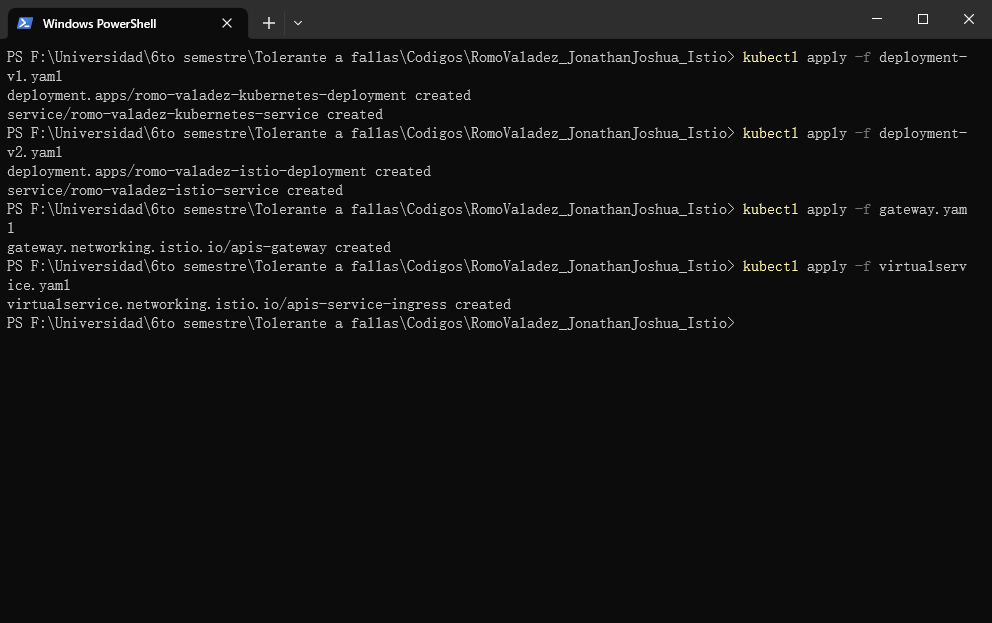
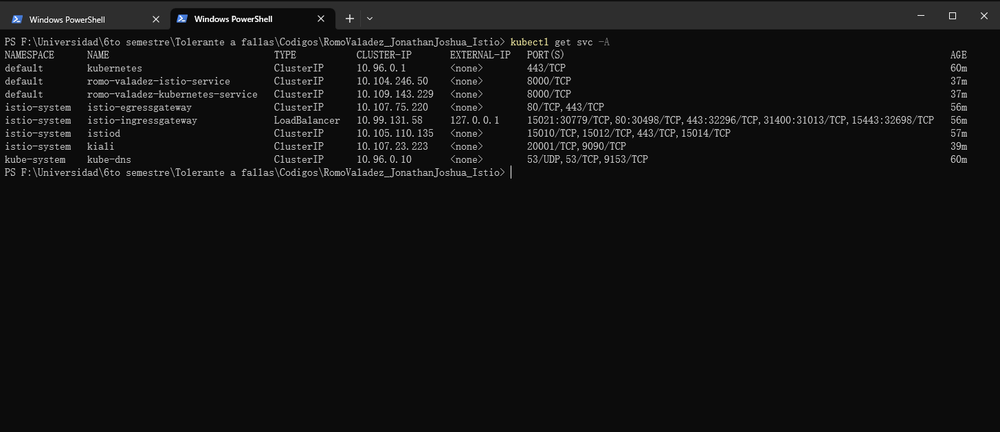
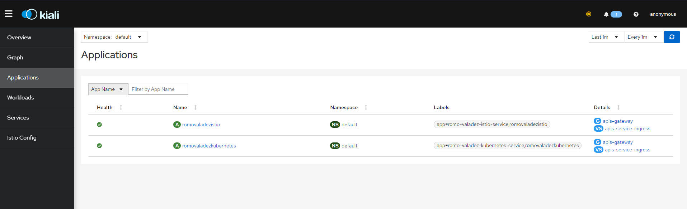
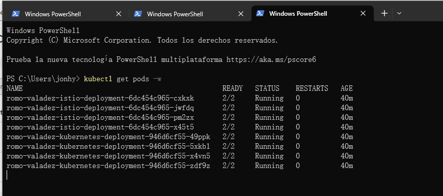
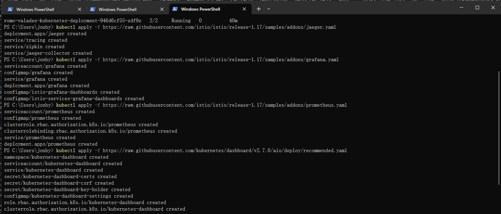

# Istio
_Romo Valadez Jonathan Joshua_

_Computación tolerante a fallas_

_Universidad de Guadalajara_

_CUCEI_

_Departamento de ciencias computacionales_

---

## Introducción
Hay ocasiones en el que necesitamos muchas versiones de una aplicación en funcionamiento, ya sea para hacer tests o porque hay herramientas que no se deben de tener en algunas versiones. Para esto nos sirve Istio, que nos permite subir diferentes versiones de una aplicación a la nube.

Las condiciones para acceder a una versión u otra se pueden personalizar, haciendolo bastante útil para los desarrolladores.

---

## Desarrollo

### ¿Que es Istio?
Istio es una malla de servicios (es decir, una capa de redes de servicios modernizada) que ofrece una manera transparente e independiente de cualquier lenguaje de automatizar las funciones de red de una aplicación de forma flexible y sencilla. Es una solución muy popular para gestionar los diferentes microservicios que conforman una aplicación nativa de la nube. La malla de servicios de Istio también es compatible con las formas de comunicarse y compartir datos entre ellos que utilizan estos microservicios.

### Programa de ejemplo
Se utilizará el programa de la anterior práctica para realizar esta práctica.

~~~python
from fastapi import FastAPI
import requests

app = FastAPI()

@app.on_event("startup")
def startup():
    print("Bonjour")

@app.on_event("shutdown")
def shutdown():
    print("Arrive Derchi")

@app.get("/{Nombre}")
async def root(Nombre: str):
    lista = []
    response = requests.get('https://api.publicapis.org/entries')
    response = response.json()
    items = response['entries']
    item_list = list(items)
    for item in item_list:
        posicion = item["API"].find(Nombre)
        if posicion != -1:
            lista.append(item)
    return lista

@app.get("/")
async def root():
    response = requests.get('https://api.publicapis.org/entries')
    response = response.json()
    items = response['entries']
    item_list = list(items)
    return item_list
~~~

Se creará otra imagen de docker para tener 2 versiones diferentes de la aplicación. Se tendrán también 2 yaml, uno para el gateway y otro para el virtual service.

~~~yaml
apiVersion: networking.istio.io/v1alpha3
kind: Gateway
metadata:
  name: apis-gateway
spec:
  selector:
    app: istio-ingressgateway
  servers:
  - port:
      number: 80
      name: tcp
      protocol: TCP
    hosts:
    - "*"
~~~

~~~yaml
apiVersion: networking.istio.io/v1alpha3
kind: VirtualService
metadata:
  name: apis-service-ingress
spec:
  hosts: 
  - '*'
  gateways:
  - apis-gateway
  http:
  - match:
    - headers:
        user-agent:
          regex: .*Chrome.*
    route:
    - destination:
        host: romo-valadez-kubernetes-service
  - route:
    - destination:
        host: romo-valadez-istio-service
~~~

Una vez descargado Istio y agregado al path, se puede instalar.

Se configurará Istio para inyectarlo en los pods que se crean.

En este caso se agregará kiali para la visualización.

Se aplicará todos los yaml necesarios.

Se podrá ver el gateway de istio para comprobar que esté funcionando.

En kiali se pueden comprobar las aplicaciones.

Se podrán comprobar los pods corriendo.

También se podrá ver la gráfica de las aplicaciones en kiali.

---

## Conclusión
Esta actividad ayudó mucho para aprender una herramienta bastante interesante como istio, que es como una mejora de lo que ofrece kubernetes, pues permite el despliegue de multiples versiones de una aplicación y sus condiciones para poder usar esas versiones.

Esto implica aún más tolerancia a fallas, que con solo kubernetes era bastante buena.
